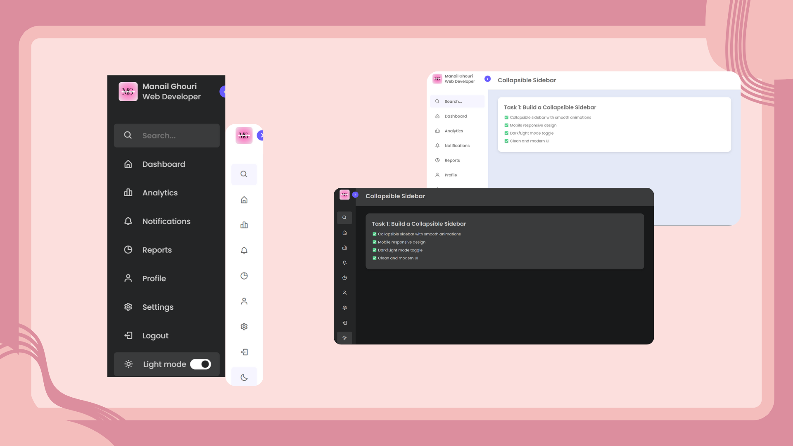

# Collapsible Sidebar Dashboard

A modern, responsive **HTML, CSS, and JavaScript** project featuring:
- Collapsible sidebar with smooth animations
- Clean **white + purple** light theme and sleek **black** dark mode
- Topbar with dark-mode toggle
- Responsive card-based dashboard layout

---
## 🌐 Live Demo

👉 [**Demo**](https://golden-alfajores-8ab72a.netlify.app/)


## 📸 Preview



---

## 🚀 Features
- **Collapsible Sidebar** — clean animation for expanding/collapsing
- **Light/Dark Mode** — toggle between bright white-purple and dark black themes
- **Responsive Design** — works perfectly on desktop, tablet, and mobile
- **Modern UI** — cards with subtle shadows and hover effects

---

## 🛠️ Technologies Used
- **HTML5**
- **CSS3** (Flexbox & Grid)
- **JavaScript** (for sidebar and dark mode toggle)
- **Boxicons** (for icons)

---

## 📂 Project Setup

1. **Clone the repository**:
   ```sh
   git clone https://github.com/Manailghouri/Sidebar.git
